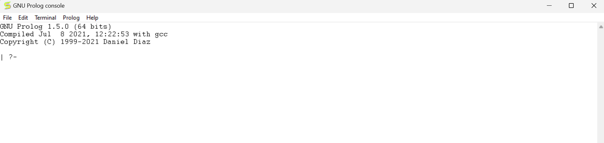
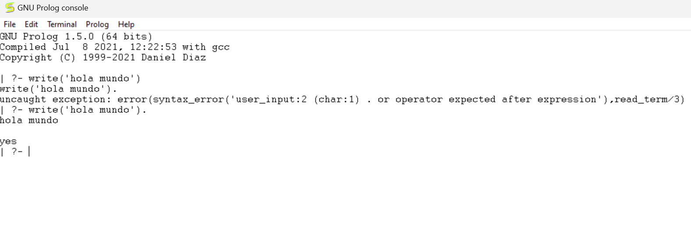
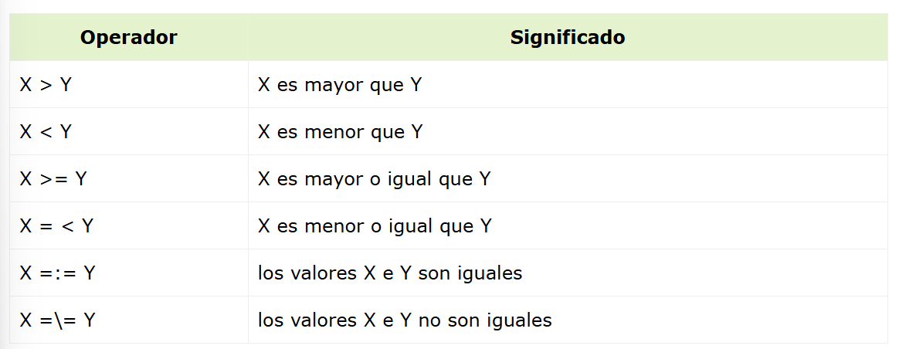
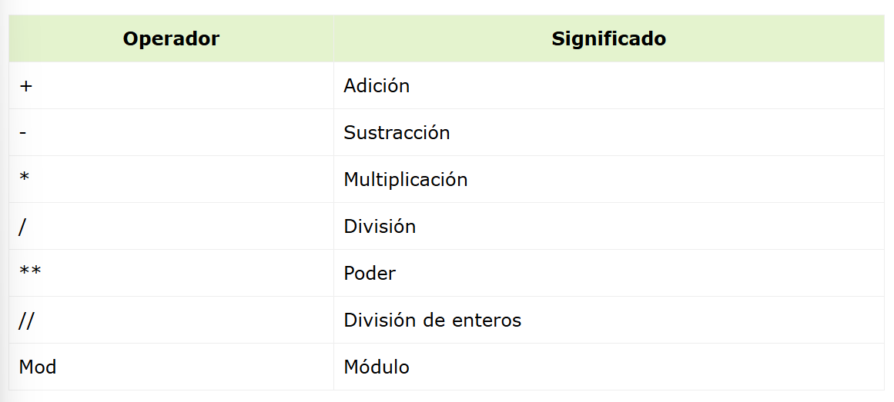
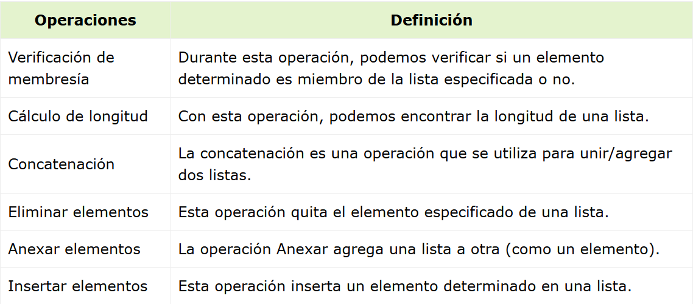
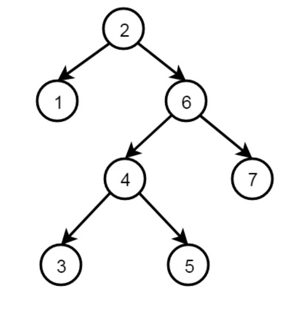
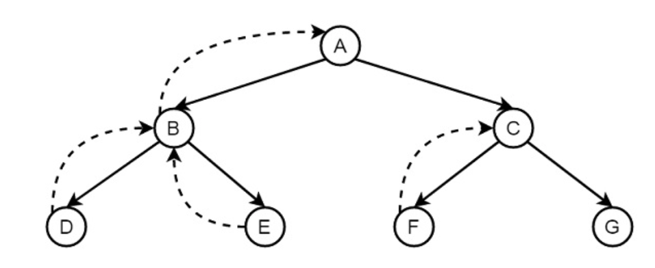

# Reporte Practica 4 Paradigmas de la programacion

## Hernandez Ceseña Ivan Fernando

## introduccion a Prolog

## Primer paso para utilizar prolog
instalarlo

no se ocupa mover alguna configuracion para instalarlo. Solo se presiona siguiente siguiente siguiente y listo.


Abrimos prolog y nos aparecera una interfaz como esta



## escribimos un hola mundo

```prolog
write('Hola Mundo').
```


un detalle muy importante es que cada instruccion en prolog debe terminar con un punto.

## Base de conocimientos
En esta nos habla de que prolog es un lenguaje de programacion que se basa en la logica, y que se basa en hechos y reglas.

### Hechos
Los hechos son afirmaciones que se consideran verdaderas. Se representan de la siguiente manera

```prolog
cat(tom).
loves_to_eat(kunal,pasta).
of_color(hair,black).
loves_to_play_games(nawaz).
lazy(pratyusha).
```
En estos ejemplos se estan declarando hechos, como que tom es un gato, kunal le gusta comer pasta, el cabello es negro, nawaz le gusta jugar y pratyusha es floja.

#### pautas para los hechos
- Los nombres de las propiedades o relaciones comienzan con letras minúsculas.

- El nombre de la relación aparece como primer término.

- Los objetos aparecen como argumentos separados por comas entre paréntesis.

- Un punto "." debe poner fin a un hecho.

- Los objetos también comienzan con letras minúsculas. También pueden comenzar con dígitos (como 1234) y pueden ser cadenas de caracteres encerradas entre comillas, por ejemplo, color (penink, 'rojo').

- foníneo (Agnibha, 1122334455). también se denomina predicado o cláusula.

### reglas 
Las reglas son una relacion implicita entre objetos, por lo que los objetos son cpndocopnalmente verdaderos.
Cuando una condicion asociada es verdadera el predicado tambien lo es.

#### Ejemplos
- Lili es feliz si baila.

- Tom tiene hambre si está buscando comida.

- Jack y Bili son amigos si a ambos les encanta jugar al cricket.

- irá a jugar si la escuela está cerrada y está libre.
#### Sintaxis
```prolog
rule_name(object1, object2, ...) :- fact/rule(object1,
 object2, ...)
Suppose a clause is like :
P :- Q;R.
This can also be written as
P :- Q.
P :- R.

If one clause is like :
P :- Q,R;S,T,U.

Is understood as
P :- (Q,R);(S,T,U).
Or can also be written as:
P :- Q,R.
P :- S,T,U.
```
#### Ejemplo
```prolog
happy(lili) :- dances(lili).
hungry(tom) :- search_for_food(tom).
friends(jack, bili) :- lovesCricket(jack), lovesCricket(bili).
goToPlay(ryan) :- isClosed(school), free(ryan).
```

### consultas
Las consultas son preguntas que se hacen a la base de conocimientos, y se responden con un si o un no.
- ¿Tom es un gato?

- ¿A Kunal le encanta comer pasta?

- ¿Lili es feliz?

- ¿Irá Ryan a jugar?

## Relaciones
Las relaciones son una forma de conectar dos o más objetos. En Prolog, las relaciones se pueden definir como hechos o reglas.

Podemos definir una relación de hermanos de la siguiente manera:

Dos personas son hermanos, si,

- Ambos son hombres.

- Tienen el mismo padre.

Ahora considere que tenemos las siguientes frases:

padre(sudip, piyus).

padre (sudip, raj).

macho (piyus).

macho (raj).

hermano (X, Y) :- padre (Z, X), padre (Z, Y), hombre (X), hombre (Y)

La relación revisada puede ser la siguiente:

- A y B son hermanos si −
- A y B, ambos son hombres
- Tienen el mismo padre
- Tienen la misma madre 
- A y B no son lo mismo

## Objetos de datos
A continuación se muestran algunos ejemplos de diferentes tipos de objetos de datos:

- Átomos: tom, pat, x100, x_45

- Números − 100, 1235, 2000.45

- Variables − X, Y, Xval, _X

- Estructuras − día(9, jun, 2017), punto(10, 25)
### Átomos
Los átomos son una variación de constantes. Pueden ser cualquier nombre u objeto. Hay algunas reglas que deben seguirse cuando intentamos usar átomos como se indica a continuación:

Cadenas de letras, dígitos y el carácter de subrayado, '_', que comienza con una letra minúscula. Por ejemplo:

- Azahar

- b59

- b_59

- b_59AB

- b_x25

- antara_sarkar

Cadenas de caracteres especiales
Tenemos que tener en cuenta que cuando se usan átomos de esta forma, es necesario tener cierto cuidado ya que algunas cadenas de caracteres especiales ya tienen un significado predefinido; por ejemplo ':-'.

- <--->

- =======>

- ...

- .:.

- ::=

Cadenas de caracteres entre comillas simples.
Esto es útil si queremos tener un átomo que comience con una letra mayúscula. Al encerrarlo entre comillas, lo distinguimos de las variables:

- 'Rubai'

### Variables anonimas
Las variables anónimas son variables que no tienen un nombre. Se utilizan cuando no necesitamos el valor de la variable en el futuro. En Prolog, las variables anónimas se representan con un guion bajo, '_'.

## Operadores
Los operadores son símbolos que se utilizan para realizar operaciones en los datos. En Prolog, los operadores se dividen en los siguientes tipos:


ejemplo:
```prolog
| ?- 1+2=:=2+1.

yes
| ?- 1+2=2+1.

no
| ?- 1+A=B+2.

A = 2
B = 1

yes
| ?- 5<10.

yes
| ?- 5>10.

no
| ?- 10=\=100.

yes
```
### Operadores aritméticos
Los operadores aritméticos se utilizan para realizar operaciones aritméticas en los datos. Los operadores aritméticos en Prolog son los siguientes:


## Bucles
Los bucles son una forma de repetir una tarea varias veces. En Prolog, los bucles se pueden implementar:
- Recursión : La recursión es un proceso en el que una función se llama a sí misma como parte de su propia definición. En Prolog, la recursión se utiliza para implementar bucles.
```prolog
count_to_10(10) :- write(10),nl.
count_to_10(X) :-
   write(X),nl,
   Y is X + 1,
   count_to_10(Y).
```

### Toma de decisiones
Las sentencias de decisión son sentencias If-Then-Else.
```prolog
If <condition> is true, Then <do this>, Else 
```

## Cinjunciones y disyunciones
- La lógica de conjunción (AND) se puede implementar mediante el operador de coma (,). Por lo tanto, dos predicados separados por coma se unen con la instrucción AND.
- La disyunción (lógica OR) se puede implementar mediante el operador de punto y coma (;). Por lo tanto, dos predicados separados por punto y coma se unen con la instrucción OR.

```prolog
parent(jhon,bob).
parent(lili,bob).

male(jhon).
female(lili).

% Conjunction Logic
father(X,Y) :- parent(X,Y),male(X).
mother(X,Y) :- parent(X,Y),female(X).

% Disjunction Logic
child_of(X,Y) :- father(X,Y);mother(X,Y).
```

## Listas
Las listas se utilizan para almacenar los átomos como una colección.

La lista es una estructura de datos simple que se usa ampliamente en programación no numérica.
La lista consta de cualquier número de elementos, por ejemplo, rojo, verde, azul, blanco, oscuro. Se representará como [rojo, verde, azul, blanco, oscuro]. La lista de elementos se encerrará entre corchetes.
Una lista puede estar vacía o no vacía. En el primer caso, la lista se escribe simplemente como un átomo de prólogo, []. En el segundo caso, la lista consta de dos cosas, como se indica a continuación:
- El primer elemento, llamado cabeza de lista;

- La parte restante de la lista, llamada cola.

Ahora, consideremos que tenemos una lista, L = [a, b, c]. Si escribimos Tail = [b, c] entonces también podemos escribir la lista L como L = [ a | Cola]. Aquí la barra vertical (|) separa las partes de la cabeza y la cola.

Por lo tanto, las siguientes representaciones de lista también son válidas:
- [a, b, c] = [x | [b, c] ]

- [a, b, c] = [a, b | [c] ]

- [a, b, c] = [a, b, c | [ ] ]

### Operaciones de lista


### concatenacion de listas
```prolog
append([],L,L).
append([X|L1],L2,[X|L3]) :- append(L1,L2,L3).
```

### eliminar un elemento de una lista
- Si X es el único elemento, después de eliminarlo, devolverá una lista vacía.

- Si X es la cabeza de L, la lista resultante será la parte de la cola.

-  X está presente en la parte de la cola, elimínela de allí de forma recursiva.
  
```prolog
list_delete(X, [X], []).
list_delete(X,[X|L1], L1).
list_delete(X, [Y|L2], [Y|L1]) :- list_delete(X,L2,L1).
```

## Recursividad y estructuras
La recursividad en Prolog permite que un predicado se llame a sí mismo, posiblemente con modificaciones en sus argumentos, para resolver problemas de manera iterativa.

Las estructuras en Prolog son objetos de datos que contienen múltiples componentes. Estos componentes pueden ser de diferentes tipos, como átomos, números, variables, listas, etc.

### coincidencia en prolog
La coincidencia en Prolog es un proceso en el que se comparan dos términos para ver si son iguales. Si los términos son iguales, la coincidencia se considera exitosa y se devuelve verdadero. Si los términos no son iguales, la coincidencia se considera fallida y se devuelve falso.

- Si S y T son constantes, S=T si ambos son objetos iguales.

- Si S es una variable y T es cualquier cosa, T = S.

- Si T es variable y S es cualquier cosa, S = T.

### Arboles binarios
Un árbol binario es una estructura de datos en la que cada nodo tiene como máximo dos hijos, que se denominan hijo izquierdo e hijo derecho.


La definición de la estructura es la siguiente:
```prolog
node(2, node(1,nil,nil), node(6, node(4,node(3,nil,nil), node(5,nil,nil)), node(7,nil,nil))
```

## Retroceso
El retroceso es un procedimiento en el que prolog busca el valor de verdad de diferentes predicados comprobando si son correctos o no.
El término backtracking es bastante común en el diseño de algoritmos y en diferentes entornos de programación. En Prolog, hasta que llega al destino adecuado, intenta retroceder. Cuando se encuentra el destino, se detiene.

Supongamos que de la A a la G hay algunas reglas y hechos. Partimos de la A y queremos llegar a la G. El camino correcto será A-C-G, pero al principio, irá de A a B, luego de B a D. Cuando encuentra que D no es el destino, retrocede a B, luego va a E, y retrocede nuevamente a B, ya que no hay otro hijo de B, luego retrocede a A, por lo que busca G, y finalmente encuentra G en el camino A-C-G.

### Backtracking en Prolog
El backtracking en Prolog es un proceso en el que Prolog intenta encontrar todas las posibles soluciones para un problema. Si una solución falla, Prolog intenta encontrar otra solución. Prolog intenta encontrar todas las posibles soluciones para un problema.

- El punto y coma (;) se utilizan para indicar a Prolog que busque más soluciones. Si no se encuentra ninguna solución, Prolog devuelve falso.

### Precauciones en el backtracking
- El backtracking puede ser ineficiente si no se mide el control.
- solucion: e introdujo el operador de corte (!) en Prolog para controlar el backtracking. El corte se utiliza para eliminar alternativas que sabemos que no conducirán a una solución válida, mejorando así la eficiencia del programa.

## Predicados diferentes y no diferentes
El predicado diferente comprobará si dos argumentos dados son iguales o no. Si son iguales, devolverá false, de lo contrario devolverá true.
el término "diferente" se puede expresar de tres maneras diferentes, como se indica a continuación:

- X e Y no son literalmente lo mismo

- X e Y no coinciden

- Los valores de las expresiones aritméticas X e Y no son iguales

La relación no es muy útil en diferentes casos. En nuestros lenguajes de programación tradicionales también, usamos la operación lógica not para negar alguna declaración.

En el prólogo, podemos definir esto como se muestra a continuación:
```prolog
not(P) :- P, !, fail ; true.
```

## Predicados de entrada y salida
Los predicados de entrada y salida se utilizan para leer y escribir datos en Prolog. Los predicados de entrada y salida en Prolog son los siguientes:
predicado write()
```prolog
| ?- write(56).
56

yes
| ?- write('hello').
hello

yes
| ?- write('hello'),nl,write('world').
hello
world

yes
| ?- write("ABCDE")
.
[65,66,67,68,69]

yes
```
predicado read()
```prolog
cube :-
   write('Write a number: '),
   read(Number),
   process(Number).
process(stop) :- !.
process(Number) :-
   C is Number * Number * Number,
   write('Cube of '),write(Number),write(': '),write(C),nl, cube.
```

Si queremos escribir en un archivo, excepto en la consola, podemos escribir el predicado tell(). Este predicado tell()toma el nombre del archivo como argumento. Si ese archivo no está presente, cree un nuevo archivo y escriba en él.
```prolog
| ?- told('myFile.txt').
uncaught exception: error(existence_error(procedure,told/1),top_level/0)
| ?- told("myFile.txt").
uncaught exception: error(existence_error(procedure,told/1),top_level/0)
| ?- tell('myFile.txt').

yes
| ?- tell('myFile.txt').

yes
| ?- write('Hello World').

yes
| ?- write(' Writing into a file'),tab(5),write('myFile.txt'),nl.

yes
| ?- write("Write some ASCII values").

yes
| ?- told.

yes
| ?-
```
salida:
```prolog
Hello World Writing into a file     myFile.txt
[87,114,105,116,101,32,115,111,109,101,32,65,83,67,73,73,32,118,97,108,117,101,115]
```

## Implementacion de estructura de datos de control


Tenemos que implementar este árbol usando prolog. Tenemos algunas operaciones de la siguiente manera:
- op(500, xfx, 'is_parent').

- op(500, xfx, 'is_sibling_of').

- op(500, xfx, 'is_at_same_level').

- Y otro predicado, a saber, leaf_node(Nodo)

En estos operadores, ha visto algunos parámetros como (500, xfx, <operator_name>). El primer argumento (aquí 500) es la prioridad de ese operador. El 'xfx' indica que se trata de un operador binario y el <operator_name> es el nombre del operador.

Estos operadores se pueden utilizar para definir la base de datos de árbol. Podemos usar estos operadores de la siguiente manera:

- A is_parent B, o is_parent(a, b). Esto indica que el nodo a es el padre del nodo b.

- X is_sibling_of Y o is_sibling_of(X,Y). Esto indica que X es el hermano del nodo Y. Por lo tanto, la regla es que si otro nodo Z es el padre de X y Z también es el padre de Y y X e Y son diferentes, entonces X e Y son hermanos.

- leaf_node(Nodo). Se dice que un nodo (Node) es un nodo hoja cuando un nodo no tiene hijos.

- X is_at_same_level Y, o is_at_same_level(X,Y). Esto comprobará si X e Y están en el mismo nivel o no. Entonces, la condición es que cuando X e Y son iguales, entonces devuelve verdadero, de lo contrario, W es el padre de X, Z es el padre de Y y W y Z están en el mismo nivel.
### Programa
```prolog
/* The tree database */

:- op(500,xfx,'is_parent').

a is_parent b. c is_parent g. f is_parent l. j is_parent q.
a is_parent c. c is_parent h. f is_parent m. j is_parent r.
a is_parent d. c is_parent i. h is_parent n. j is_parent s.
b is_parent e. d is_parent j. i is_parent o. m is_parent t.
b is_parent f. e is_parent k. i is_parent p. n is_parent u.
n 
is_parent v.
/* X and Y are siblings i.e. child from the same parent */

:- op(500,xfx,'is_sibling_of').

X is_sibling_of Y :- Z is_parent X,
                     Z is_parent Y,
                     X \== Y.
leaf_node(Node) :- \+ is_parent(Node,Child). % Node grounded

/* X and Y are on the same level in the tree. */

:-op(500,xfx,'is_at_same_level').
X is_at_same_level X .
X is_at_same_level Y :- W is_parent X,
                        Z is_parent Y,
                        W is_at_same_level Z.
```